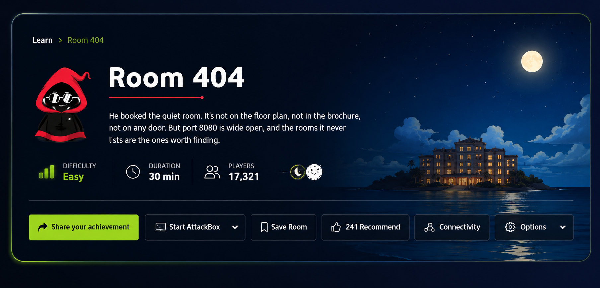
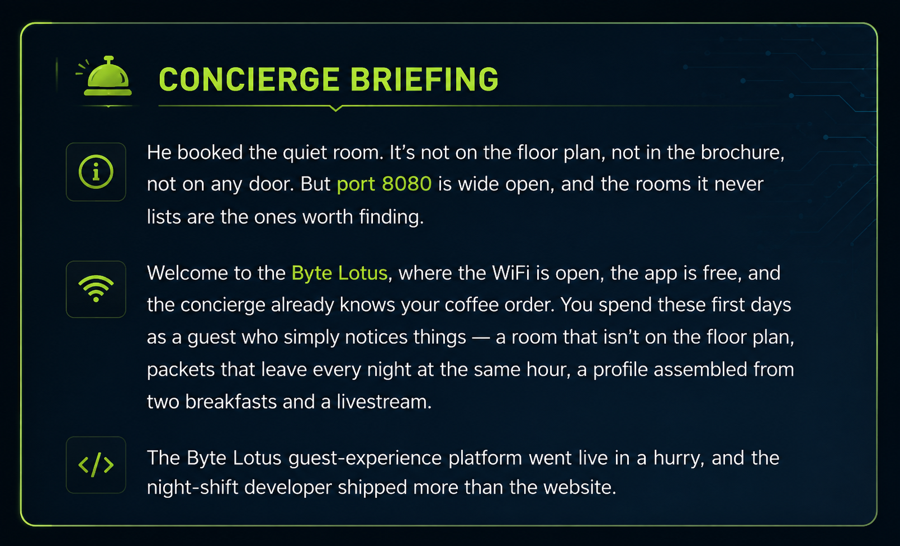
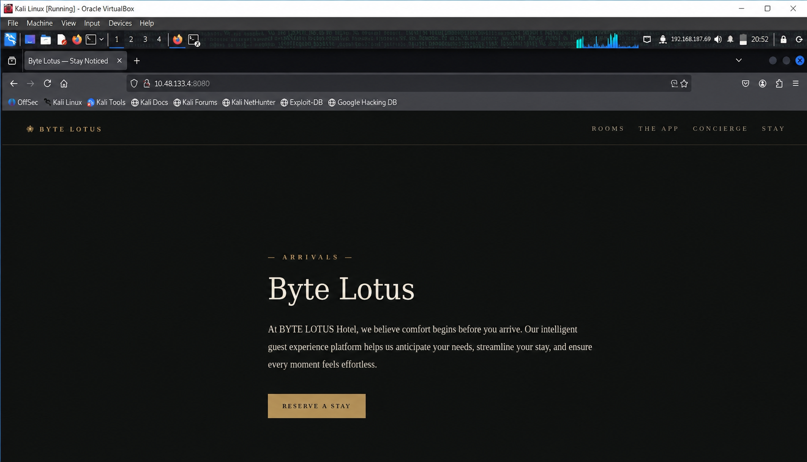
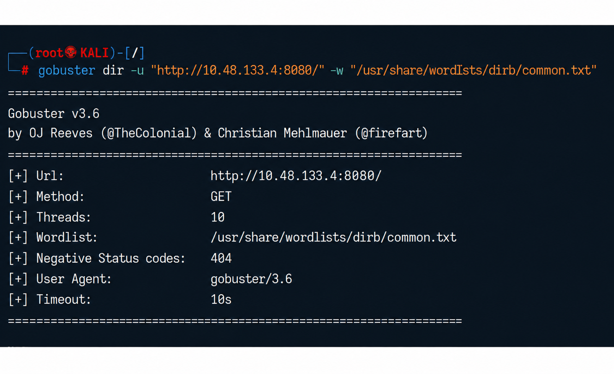
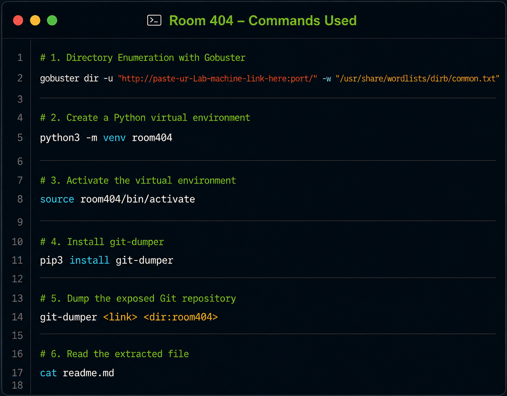
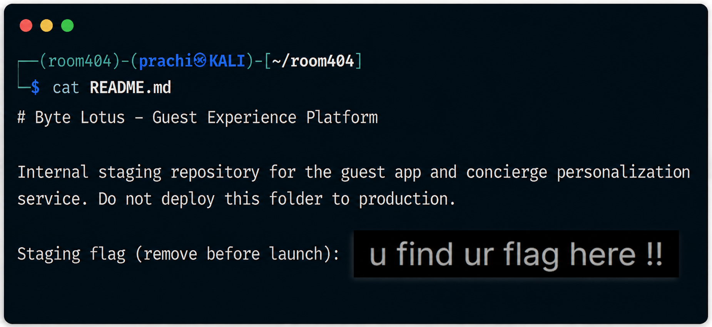

# 🌴 TryHackMe Hacker Holidays 2026

# Day 2 – Room 404

## Platform

- **Platform:** TryHackMe
- **Event:** Hacker Holidays 2026
- **Room:** Room 404
- **Difficulty:** Easy
- **Category:** Web Enumeration / Information Disclosure

---

# Room Overview

Room 404 is a beginner-friendly web security challenge that focuses on **directory enumeration** and **information disclosure**. The objective is to identify hidden resources on a web server that are not directly accessible through the website's navigation.

Rather than exploiting vulnerabilities immediately, this room emphasizes the importance of performing proper reconnaissance and enumeration to uncover exposed information.

---

# Objectives

- Explore the target web application.
- Perform directory enumeration.
- Discover hidden directories.
- Analyze the exposed content.
- Retrieve the required flag.

---

# Methodology

## Step 1 – Understand the Challenge

I started by reading the room description to understand the scenario and objectives. The challenge hinted that an important page was hidden from normal users, indicating that enumeration would play a key role.

### Screenshot

---

## Step 2 – Review the Concierge Briefing

Next, I carefully read the Concierge Briefing provided in the room. The briefing explained that some important resources were intentionally left hidden and would need to be discovered through proper web enumeration techniques.

This helped me understand the expected attack path before interacting with the target machine.

### Screenshot

---

## Step 3 – Access the Target Machine

After reviewing the challenge details, I launched the target machine and verified that the web application was accessible on the provided port.

Before performing any scans, I confirmed connectivity to ensure the target was responding correctly.

### Screenshot

---

## Step 4 – Perform Directory Enumeration

To identify hidden resources, I used **Gobuster** from my Kali Linux machine.

The enumeration process searched for directories that were not linked from the homepage. This revealed an additional endpoint that required further investigation.

### Screenshot

---

## Step 5 – Investigate the Hidden Directory

After discovering the hidden directory, I opened it in the browser to inspect its contents.

The page exposed information that was not intended to be publicly visible, demonstrating how forgotten directories can unintentionally leak sensitive data.

---

## Step 6 – Analyze the Exposed Content

I carefully reviewed the information available within the hidden directory.

The exposed content contained the data required to complete the challenge. To respect TryHackMe's learning environment, the specific solution and flag have intentionally been omitted from this write-up.

### Screenshot

---

## Step 7 – Complete the Challenge

After analyzing the discovered information, I successfully completed the room and submitted the correct flag.

This challenge reinforced the importance of reconnaissance and proper enumeration during web security assessments.

### Screenshot

---

# Tools Used

- Kali Linux
- Gobuster
- Firefox
- TryHackMe Platform

---

# Skills Practiced

- Web Enumeration
- Directory Enumeration
- Information Gathering
- Information Disclosure Analysis
- Reconnaissance
- Basic Web Security

---

# MITRE ATT&CK Mapping

| Technique ID | Technique |
|--------------|-----------|
| T1595 | Active Scanning |
| T1592 | Gather Victim Host Information |

---

# Key Takeaways

- Enumeration should always be performed before attempting exploitation.
- Hidden directories can expose sensitive information if left accessible.
- Web servers often reveal valuable intelligence through misconfigured or forgotten resources.
- Small configuration mistakes can create significant security risks.
- Reconnaissance is one of the most important phases of any penetration test.

---

# Lessons Learned

This room demonstrated that effective reconnaissance often uncovers valuable information without requiring complex exploitation techniques.

Using simple directory enumeration tools like Gobuster can quickly identify hidden endpoints that expose sensitive content. It reinforced the importance of thoroughly enumerating web applications before attempting any advanced attacks.

---

# Disclaimer

This repository is intended for educational purposes only.

The write-up documents my personal learning journey while completing the **TryHackMe Hacker Holidays 2026** event.

No challenge answers, flags, or sensitive solutions have been intentionally disclosed in accordance with TryHackMe's content guidelines.

---

## 📢 Share & Connect

If you found this write-up helpful, feel free to connect with me and follow my cybersecurity journey.

💼 **LinkedIn Post**  
https://www.linkedin.com/posts/prachi-agarwal-72a15729a_tryhackme-hackerholidays2026-cybersecurity-ugcPost-7489727287991578625-5AbW/

⭐ If you like this repository, consider giving it a star!

---
