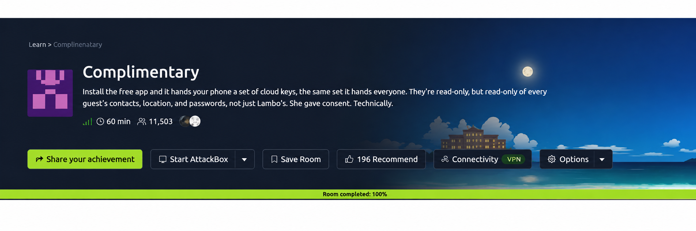
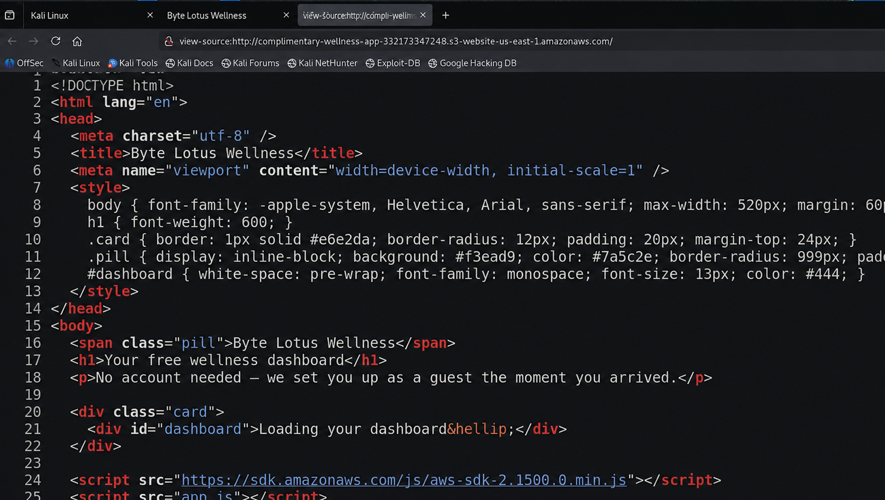
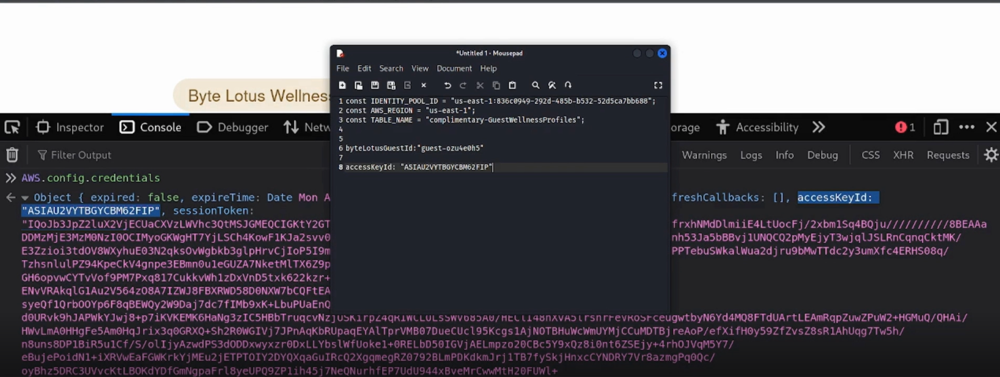
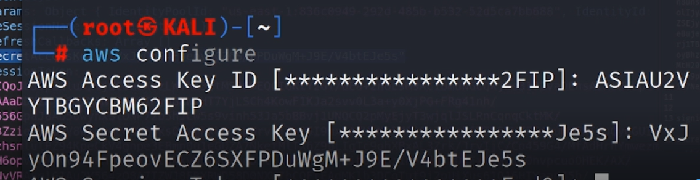
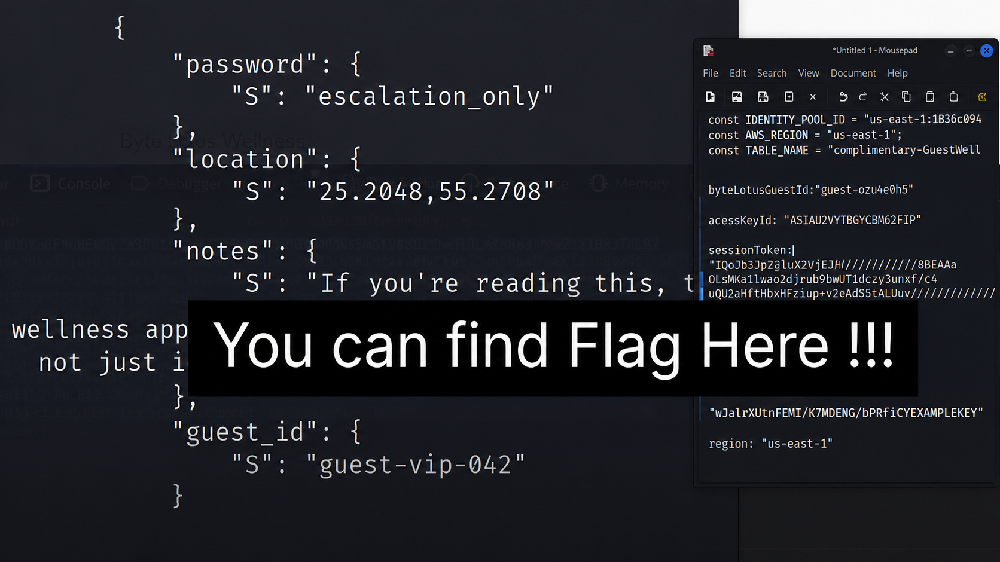

# 🎄 TryHackMe - Hacker Holidays 2026

# Day 03 – Complimentary

## Room Information

| Category | Difficulty | Points |
|----------|------------|--------|
| Cloud / AWS | Easy | 60 |

---

# Room Objective

The objective of this room was to investigate a cloud-based wellness application, discover exposed AWS configuration details, retrieve temporary AWS credentials, access the backend DynamoDB database, and recover the hidden flag.

---

# Skills Practiced

- JavaScript Enumeration
- Browser Developer Tools
- AWS Cognito Enumeration
- AWS CLI
- DynamoDB Enumeration
- Cloud Security Assessment

---

# Methodology

## Step 1 – Explore the Target

After deploying the machine, I opened the provided web application and carefully reviewed the room description to understand the objective.

The challenge focused on identifying how the application generated AWS credentials and using those credentials to access data stored in DynamoDB.

### Screenshot



---

## Step 2 – Inspect the Web Application

I explored the website manually and then viewed the page source.

The HTML itself didn't reveal anything interesting, but I noticed an external JavaScript file named **app.js**.

Since JavaScript files often expose useful information during web assessments, I examined its contents.

Inside the script I discovered several important AWS-related values, including:

- AWS Region
- Cognito Identity Pool ID
- DynamoDB Table Name

These details confirmed that the application was communicating with AWS services.

### Screenshot



---

## Step 3 – Extract Temporary AWS Credentials

Next, I opened the browser's **Developer Tools** and inspected the application's storage and console.

Using the AWS SDK available within the browser, I displayed the application's active credentials.

This exposed temporary AWS credentials, including:

- Access Key ID
- Secret Access Key
- Session Token
- Region

These credentials were later used to authenticate with AWS CLI.

### Screenshot



---

## Step 4 – Configure AWS CLI

After collecting the temporary credentials, I configured AWS CLI on Kali Linux.

I supplied:

- Access Key
- Secret Access Key
- Session Token
- AWS Region

This authenticated my local AWS CLI session with the temporary guest permissions provided by the application.

### Screenshot



---

## Step 5 – Enumerate DynamoDB

Using AWS CLI, I interacted with the exposed DynamoDB table identified earlier.

Instead of accessing only my own guest profile, I enumerated the entire table.

The scan returned multiple guest records containing profile information.

While reviewing the database entries, I successfully located the hidden flag.

### Screenshot



---

# Commands Used

```bash
# Configure AWS CLI
aws configure

# Display DynamoDB help
aws dynamodb help

# Scan DynamoDB table
aws dynamodb scan
```
---

# Key Takeaways

- Always inspect JavaScript files during web assessments.
- Browser Developer Tools can reveal sensitive client-side information.
- Temporary AWS credentials should never be exposed to end users.
- Misconfigured IAM permissions can allow unauthorized access to backend services.
- DynamoDB tables should follow the principle of least privilege.

---

# Flag

```
THM{***************}
```

---

## GitHub Repository

https://github.com/techyprachi/THM_Hacker_Holidays_2026

---

## LinkedIn Walkthrough

https://www.linkedin.com/feed/update/urn:li:activity:7490045630309126144/
