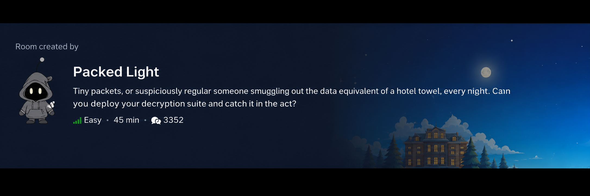
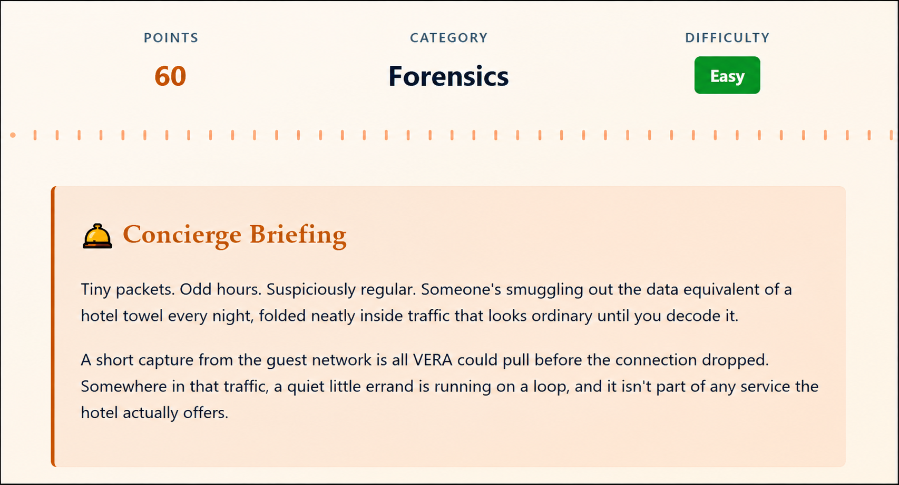
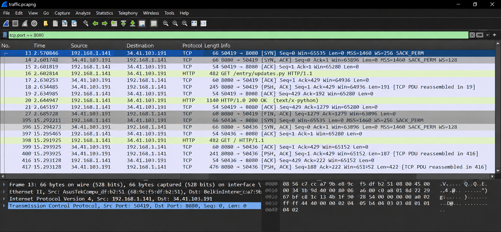
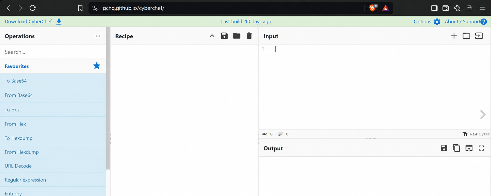
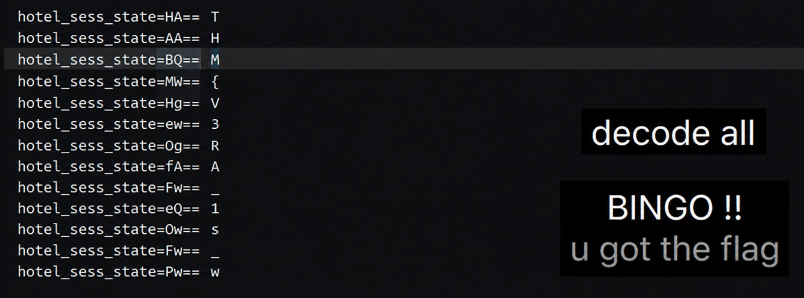

# 🌴 TryHackMe Hacker Holidays 2026

# Day 04 – Packed Light

## Platform

- **Platform:** TryHackMe
- **Event:** Hacker Holidays 2026
- **Room:** Packed Light
- **Difficulty:** Easy
- **Category:** Network Traffic Analysis | Wireshark | CyberChef

---

# Room Overview

Packed Light is a network forensics challenge focused on identifying covert data exfiltration hidden within seemingly normal HTTP traffic. The objective is to analyze the provided packet capture, identify the suspicious communication, decode the transmitted information, and recover the hidden flag.

### Screenshot



---

# Room Description

The scenario describes an attacker secretly transferring sensitive information through ordinary-looking network traffic. My task was to inspect the provided packet capture, identify the hidden communication channel, understand how the data was encoded, and recover the original message.

### Screenshot



---

# Objective

- Analyze the provided PCAP file.
- Identify suspicious HTTP communication.
- Inspect the hidden TCP stream.
- Decode the exfiltrated data.
- Recover the hidden flag.

---

# Tools Used

- Wireshark
- CyberChef

---

# Methodology

## Step 1 – Analyze Suspicious Traffic

I started by opening the provided PCAP file in Wireshark and reviewing the room description to understand the attack scenario.

The room hinted that data was being exfiltrated through repeated communication on **TCP Port 8080**, so I filtered the capture using:

```text
tcp.port == 8080
```

This isolated the suspicious communication between the client and the remote server.

---

## Step 2 – Inspect the TCP Stream

After identifying the suspicious packets, I followed the TCP stream to inspect the complete HTTP conversation.

```
Right Click
→ Follow
→ TCP Stream
```

Inside the HTTP request, I found a Python script named **updates.py**.

Further analysis of the script revealed that it functioned as a **keylogger**, where every captured keystroke was:

- Encrypted using XOR
- Encoded using Base64
- Stored inside an HTTP cookie
- Sent back to the attacker's server

### Screenshot



---

## Step 3 – Extract Encoded Data

The HTTP requests contained a cookie named:

```
HotelSessionState
```

Each request carried an encoded value representing an encrypted keystroke.

I collected these encoded values for further analysis.

---

## Step 4 – Decode the Captured Data

Using the information discovered inside the Python script, I recreated the reverse decoding process in **CyberChef**.

The decoding workflow consisted of:

```
From Base64

↓

XOR
(Key = H)

↓

Plaintext
```

After decoding the collected values, the original hidden message appeared, successfully revealing the room flag.

### Screenshot



---

# Commands / Filters Used

## Wireshark Filter

```text
tcp.port == 8080
```

---

## HTTP Cookie Search

```text
http contains "HotelSessionState"
```

---

## Follow TCP Stream

```text
Right Click
→ Follow
→ TCP Stream
```

---

## CyberChef

```text
From Base64

↓

XOR
(Key = H)

↓

Plaintext
```
---

# Flag

The hidden message was successfully recovered after decoding the exfiltrated data.

> **Note:** The flag has intentionally been hidden to respect TryHackMe's content policy.

### Screenshot



---

# Skills Practiced

- Network Traffic Analysis
- Packet Inspection
- HTTP Analysis
- TCP Stream Analysis
- Cookie Inspection
- Base64 Decoding
- XOR Decryption
- CyberChef

---

# Key Takeaways

- Packet captures often contain valuable forensic evidence that may not be immediately visible.
- Following TCP streams provides a complete view of HTTP conversations.
- Attackers commonly combine multiple encoding techniques to hide stolen data.
- HTTP cookies can be abused as covert channels for data exfiltration.
- CyberChef is an excellent tool for reversing simple encoding and encryption techniques during investigations.

---

# Lessons Learned

This room demonstrated how attackers can disguise sensitive information inside normal web traffic. By combining Wireshark with CyberChef, I was able to inspect the communication, understand the encoding process, reverse the obfuscation, and recover the hidden message.

---

## 🔗 Related Resources

- 📂 **GitHub Repository:** https://github.com/techyprachi/THM_Hacker_Holidays_2026
- 💼 **LinkedIn Walkthrough:** *(Add your LinkedIn post link here after publishing.)*

---

# Disclaimer

This repository is created for educational purposes only.

No challenge answers or flags have been intentionally disclosed. The objective of this write-up is to document my learning journey while completing the **TryHackMe Hacker Holidays 2026** series.
