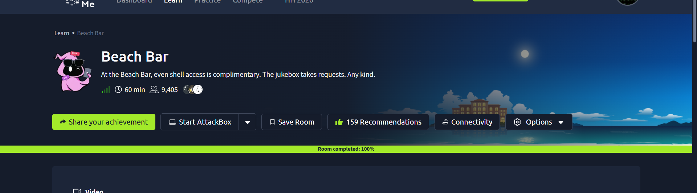
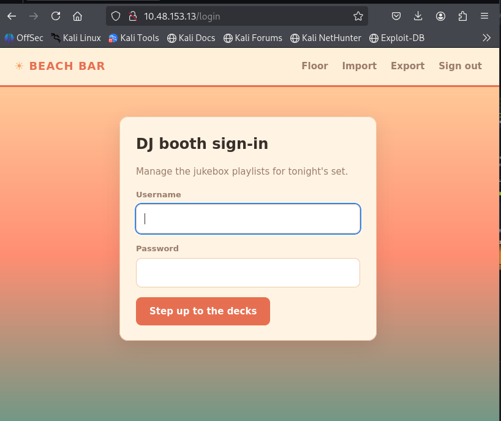
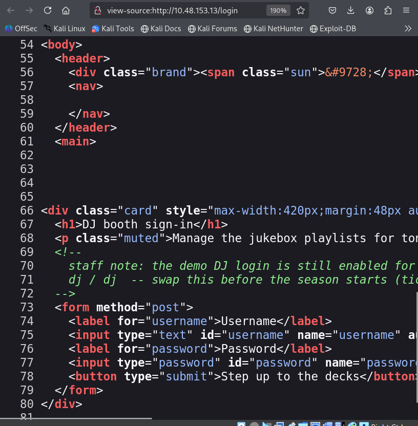
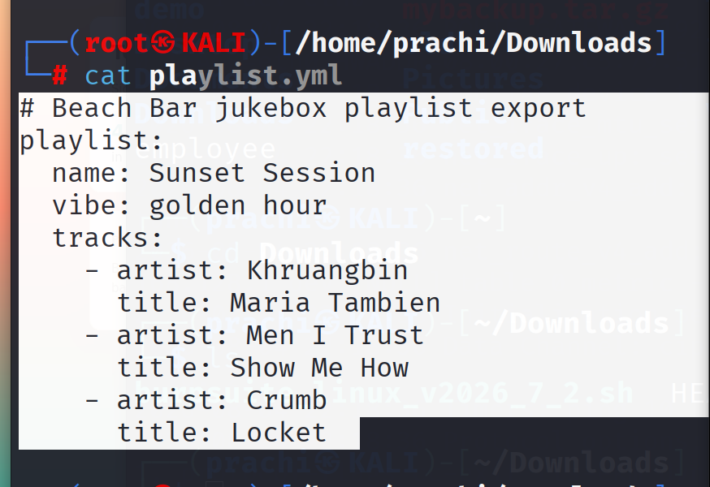
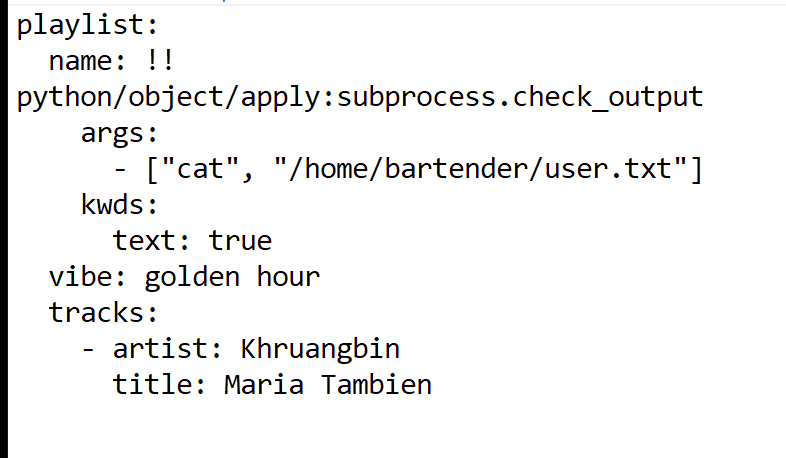
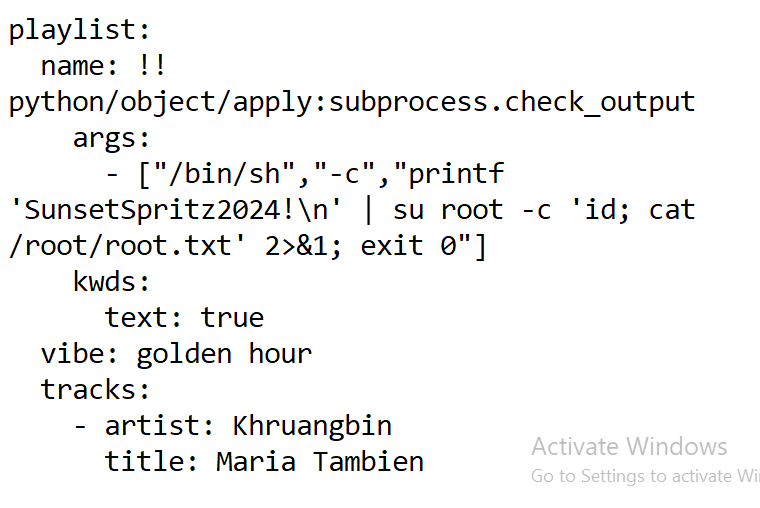
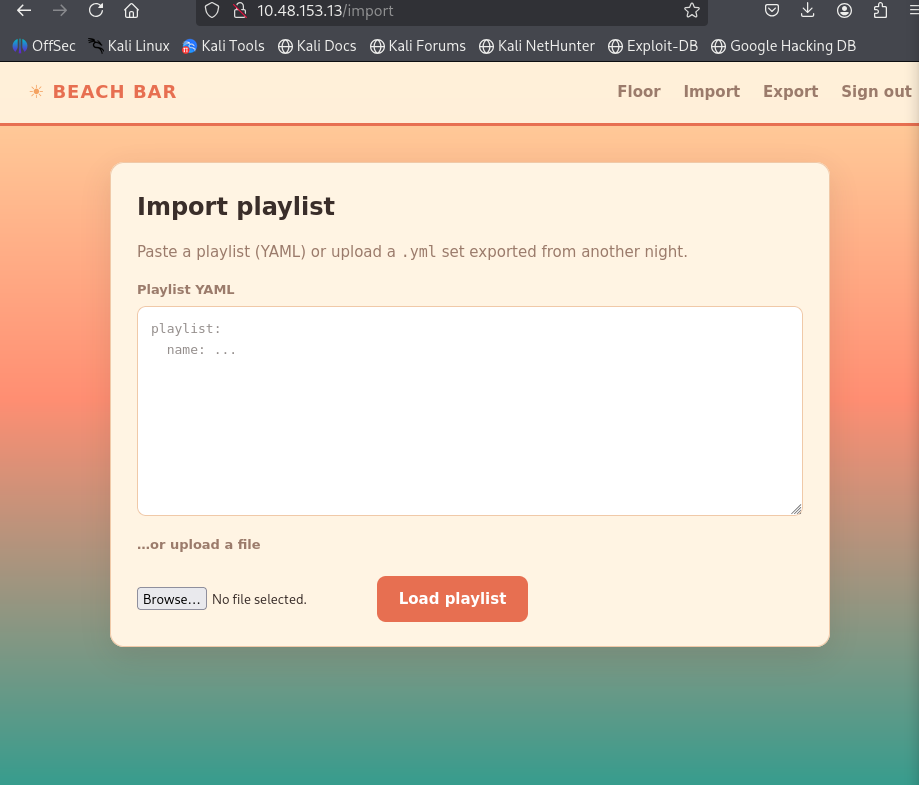

# 🌴 Day 05 – Beach Bar

> **Room:** Beach Bar  
> **Category:** Web Security / Deserialization  
> **Difficulty:** Easy  
> **Platform:** TryHackMe – Hacker Holidays 2026

---

# 📖 Room Overview

The Beach Bar room demonstrates how insecure handling of YAML files can lead to Remote Code Execution (RCE). During this challenge, I discovered exposed credentials in the page source, logged into the DJ dashboard, analyzed an exported playlist, and abused unsafe YAML deserialization to execute system commands and retrieve both the **user** and **root** flags.

---

## 🖼️ Room Overview



---

# 🎯 Objective

- Connect to the TryHackMe lab
- Analyze the web application
- Discover hidden login credentials
- Explore the playlist export feature
- Identify the YAML deserialization vulnerability
- Craft malicious YAML payloads
- Capture the User Flag
- Capture the Root Flag

---

# 🛠️ Tools Used

- Kali Linux
- Firefox Browser
- View Source
- Terminal
- YAML
- TryHackMe VPN

---

# 🚀 Step 1 – Connect to the Lab

I first connected my Kali Linux machine to the TryHackMe VPN and opened the provided lab machine IP in Firefox.

The application displayed a login page for the Beach Bar DJ Booth.



---

# 🔍 Step 2 – Inspect the Page Source

Instead of trying random credentials, I inspected the page source.

Inside an HTML developer comment I discovered that a demo DJ account was still enabled.

**Credentials Found**

```
Username : dj
Password : dj
```

This highlights why developers should never leave sensitive information inside production source code.



---

# 🔑 Step 3 – Login to the Dashboard

Using the discovered credentials, I logged into the application successfully.

The dashboard contained multiple features including:

- Floor
- Import
- Export

The **Export** option immediately caught my attention.

---

# 📂 Step 4 – Analyze the Exported Playlist

I exported the playlist and inspected its contents from the terminal.

```bash
cat playlist.yml
```

The exported YAML file revealed the application's expected file structure.



---

# ⚠️ Step 5 – Identify the Vulnerability

Since the application imports YAML files directly, I suspected an **unsafe YAML deserialization** vulnerability.

Instead of importing a normal playlist, I crafted custom YAML payloads capable of executing operating system commands.

---

# 🚩 Step 6 – User Flag

My first payload executed a command that retrieved the **user flag**.

After importing the malicious YAML file, the application executed the payload successfully.



---

# 👑 Step 7 – Root Flag

After confirming command execution, I modified the payload to execute privileged commands and retrieve the **root flag**.

Uploading the second payload successfully returned the root flag.



---

# 📥 Importing the Payload

Both payloads were uploaded through the application's **Import Playlist** feature.

Once imported, the vulnerable YAML parser executed the embedded commands.



---

# 🏁 Results

✅ User Flag Captured

✅ Root Flag Captured

---

# 💡 What I Learned

- HTML source code can expose sensitive developer information.
- Export functionality often reveals an application's internal file format.
- Unsafe YAML deserialization can lead to Remote Code Execution.
- Carefully reviewing import/export features is an important part of web application testing.
- User-controlled files should never be deserialized using unsafe loaders.

---

# ⚠️ Disclaimer

This write-up is intended for educational purposes only. All testing was performed inside the authorized TryHackMe lab environment.

---
