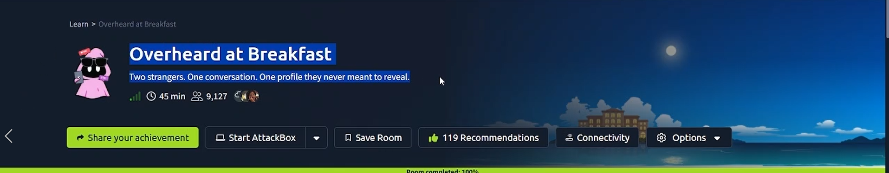
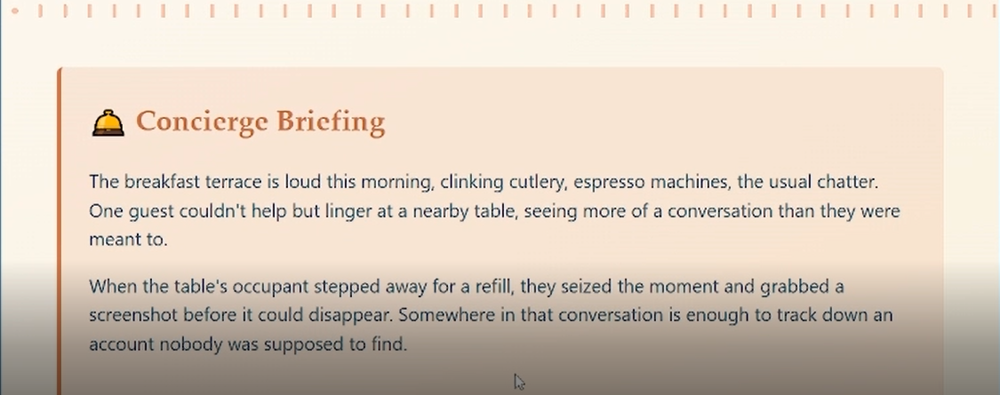
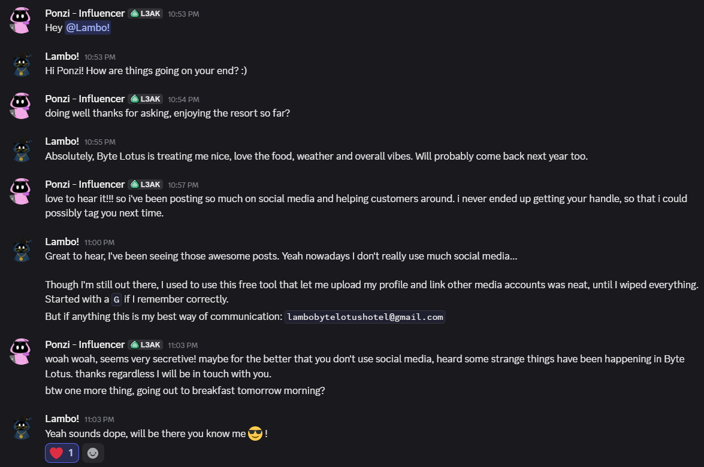
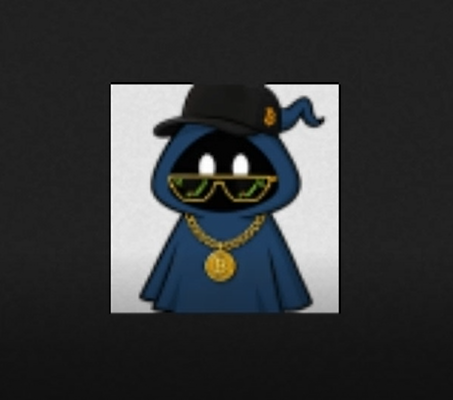
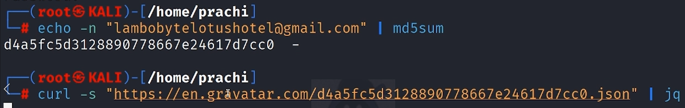
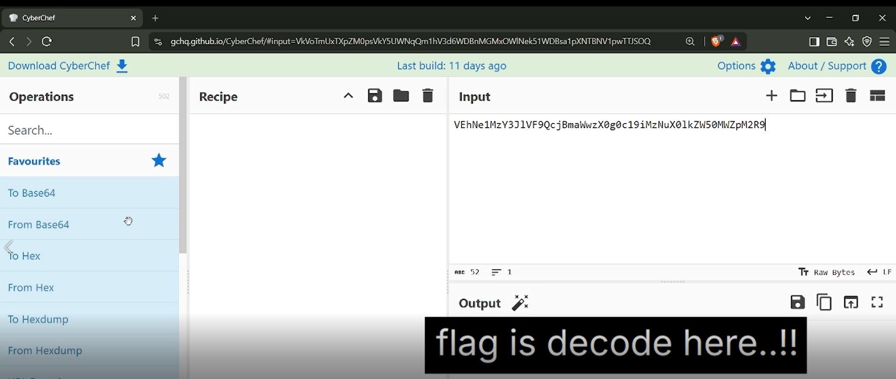

# 🍳 Day 06 – Overheard at Breakfast

> **Room:** Overheard at Breakfast  
> **Difficulty:** Easy  
> **Category:** OSINT  
> **Platform:** TryHackMe – Hacker Holidays 2026
> **Points** 60

---

## 🎥 Walkthrough

> 🔗 **LinkedIn Video:** https://www.linkedin.com/feed/update/urn:li:ugcPost:7490661730520285184/

---

## 📖 Room Overview

<p align="center">
  
</p>

The objective of this challenge was to perform an **OSINT investigation** using clues hidden inside a conversation screenshot.

Rather than exploiting a machine, the task required collecting small pieces of information, following digital footprints, and discovering a hidden online profile that eventually revealed the flag.

---

## 📜 Room Description

<p align="center">
  
</p>

The challenge provides a screenshot of a conversation between two hotel guests. Inside the conversation are several subtle hints that can be combined to locate an online profile which was never meant to be public.

The investigation demonstrates how seemingly harmless information can expose personal accounts when correlated correctly.

---

# 🛠️ Investigation Steps

## 1️⃣ Download the Conversation Screenshot

Download the provided ZIP file from the room and extract it.

It contains:

- `conversation.png`

This image contains all the clues required to solve the room.

<p align="center">
  
</p>

---

## 2️⃣ Analyze the Conversation

Carefully inspect the screenshot.

Important observations included:

- Guest name
- Email address
- Mention of a **free profile service**
- The service name starts with **G**
- It allows users to upload profile pictures and link other accounts

From these clues, the service can be identified as **Gravatar**.

---

## 3️⃣ Generate the Email Hash

Gravatar identifies users by the **MD5 hash** of their email address.

Generate the hash using:

```bash
echo -n "lambo.bytelotushotel@gmail.com" | md5sum
```

Copy the generated MD5 hash.

---

## 4️⃣ Retrieve the Gravatar Profile

Append the hash to the Gravatar avatar URL.

```
https://gravatar.com/avatar/<MD5_HASH>
```

This returns the user's avatar image.

<p align="center">
  
</p>

---

## 5️⃣ Query the Gravatar JSON Endpoint

Instead of retrieving only the avatar, request the complete profile information.

```bash
curl -s https://gravatar.com/<MD5_HASH>.json | jq
```

This reveals structured profile data including an **About Me** section.

<p align="center">
  
</p>

---

## 6️⃣ Decode the Hidden Message

The profile contained a Base64 encoded string hidden inside the biography.

Open **CyberChef**.

Use:

```
From Base64
```

Paste the encoded value to reveal the hidden flag.

<p align="center">
  
</p>

---

# 🧰 Tools Used

- Kali Linux
- MD5 Hashing
- Gravatar
- curl
- jq
- CyberChef

---

# 💻 Commands Used

```bash
# Generate MD5 hash of the email
echo -n "lambo.bytelotushotel@gmail.com" | md5sum

# Retrieve Gravatar profile data
curl -s https://gravatar.com/<MD5_HASH>.json | jq
```

---

# 🎯 Flag

```
THM{***************}
```

---

# 📚 Key Takeaways

- OSINT investigations often rely on combining multiple small clues.
- Public profile services can unintentionally expose sensitive information.
- Gravatar uses MD5 hashes of email addresses for profile identification.
- `curl` and `jq` are extremely useful for querying and formatting API responses.
- CyberChef is an excellent tool for decoding encoded data during investigations.

---

# 📝 Conclusion

This room was a beginner-friendly OSINT challenge focused on digital footprint analysis rather than exploitation.

By carefully examining the provided conversation, identifying the referenced online service, generating the corresponding MD5 hash, querying the Gravatar profile, and decoding the embedded Base64 message, the hidden flag was successfully recovered.

The challenge highlights how publicly available information can be pieced together to reveal data that users never intended to expose.
